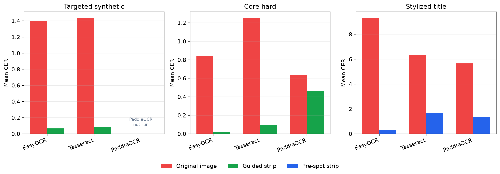

# HangulGuidedOCR

**DeepSolo-inspired ordered point guidance for Korean Apple Vision OCR.**

[](https://swift.org)
[](https://developer.apple.com/documentation/vision)
[](LICENSE)

HangulGuidedOCR is a Swift Package for correcting Korean reading-order failures produced by Apple Vision OCR. It does not replace Apple Vision and does not implement the DeepSolo model. Instead, it wraps Vision observations with DeepSolo-inspired ordered point proxies, layout evidence, duplicate suppression, and optional Korean vocabulary priors so that vertical station labels, dispersed poster titles, and stylized Korean layouts can be reconstructed in the order a Korean reader expects.

**Paper PDFs**

- **[HangulGuidedOCR: DeepSolo-inspired Ordered-Point Guidance for Korean OCR Correction (KR)](reports/hangulguidedocr_final_report_kr.pdf)**
- **[HangulGuidedOCR: DeepSolo-inspired Ordered-Point Guidance for Korean OCR Correction (EN)](reports/hangulguidedocr_final_report_en.pdf)**


> Main public repository: `wjdalswl/HangulGuidedOCR`  
> Experimental workspace/archive: `wjdalswl/textspotting-guided-vision-ocr`

## Documentation

- [Usage guide](docs/usage.md)
- [Library design notes](docs/library_design.md)
- [Method details](docs/method.md)
- [Experiment protocol](docs/experiment_protocol.md)
- [DeepSolo proxy reproduction notes](docs/deepsolo_proxy_reproduction.md)
- [Open OCR baseline comparison](docs/open_ocr_baseline_comparison.md)


## Reproducibility Map

| Need | Public location |
|---|---|
| Swift/Xcode package source | `Sources/HangulGuidedOCR/` |
| Unit tests | `Tests/HangulGuidedOCRTests/` and `swift test` |
| Installation and app usage | `Installation`, `Usage`, `docs/usage.md` |
| Method and implementation rationale | `Method Overview`, `docs/method.md`, `docs/library_design.md` |
| Experiment protocol | `docs/experiment_protocol.md` |
| Public OCR baseline summary | `docs/open_ocr_baseline_comparison.md`, `results/open_ocr_baselines/` |
| Figures and representative cases | `figures/` and `Representative Cases` |
| Full experiment workspace | `https://github.com/wjdalswl/textspotting-guided-vision-ocr` |

## Installation

Add the package in Xcode:

```text
https://github.com/wjdalswl/HangulGuidedOCR.git
```

Or add it to `Package.swift`:

```swift
.package(url: "https://github.com/wjdalswl/HangulGuidedOCR.git", branch: "main")
```

## Usage

Use HangulGuidedOCR as a correction layer around Apple Vision OCR. It is most useful when Vision detects Korean text but returns an unstable reading order, or when a small title/vertical ROI should be proposed before OCR.

Recommended app flow:

1. Run Apple Vision OCR through `HangulGuidedOCR.recognize(_:configuration:)`, or pass an ordered spot proposal through `recognize(_:proposal:configuration:)`.
2. Read both `result.rawText` and `result.guidedText`.
3. Keep `strategy: .automatic` for production so ordinary horizontal posters preserve raw Vision order while vertical or dispersed Korean layouts are reordered.
4. Provide `expectedOrder` only when the app has strong domain knowledge, such as nearby station names, menu terms, or title vocabulary.

Full guide: [docs/usage.md](docs/usage.md)

### Quick Start: Auto Correction

```swift
import CoreGraphics
import HangulGuidedOCR

let configuration = HangulOCRConfiguration(
    recognitionLevel: .accurate,
    recognitionLanguages: ["ko-KR", "en-US"],
    imageTransforms: [
        .cropNormalized(CGRect(x: 0.32, y: 0.10, width: 0.36, height: 0.78))
    ],
    readingGuide: HangulReadingGuide(
        strategy: .automatic,
        expectedOrder: ["동대문역사", "문화공원"]
    )
)

let result = try HangulGuidedOCR().recognize(cgImage, configuration: configuration)

print(result.rawText)
print(result.guidedText)
print(result.resolvedStrategy)
```

### Quick Start: Postprocess Existing Vision Results

```swift
import CoreGraphics
import HangulGuidedOCR

let observations = [
    HangulTextObservation(
        text: "문화공원",
        confidence: 0.89,
        boundingBox: CGRect(x: 0.34, y: 0.10, width: 0.08, height: 0.70)
    ),
    HangulTextObservation(
        text: "동대문역사",
        confidence: 0.91,
        boundingBox: CGRect(x: 0.64, y: 0.10, width: 0.08, height: 0.70)
    )
]

let resolved = HangulReadingOrderResolver.resolveWithStrategy(
    observations: observations,
    guide: HangulReadingGuide(
        strategy: .automatic,
        expectedOrder: ["동대문역사", "문화공원"]
    )
)

print(resolved.text)
print(resolved.resolvedStrategy)
```

### Quick Start: Pre-OCR Ordered Spot Proposal

```swift
import CoreGraphics
import HangulGuidedOCR

let titleProposal = HangulSpottingProposal.fromNormalizedRect(
    CGRect(x: 0.42, y: 0.25, width: 0.18, height: 0.50),
    direction: .verticalTopToBottom,
    expectedText: "광복절",
    normalizationPadding: 0.03,
    rotation: .clockwise90
)

let result = try HangulGuidedOCR().recognize(
    cgImage,
    proposal: titleProposal,
    configuration: HangulOCRConfiguration(
        recognitionLevel: .accurate,
        readingGuide: HangulReadingGuide(strategy: .automatic)
    )
)

print(result.guidedText)
```

## Scope and Limitations

HangulGuidedOCR is currently validated for Korean Apple Vision OCR output. It is strongest when text is present but reading order is unstable, or when a small title ROI can be proposed before OCR. It is not a replacement for a full text spotting model, and it cannot recover invisible or severely blurred characters without a usable crop or detection proposal.

The current public results focus on Korean signboards, subway vertical signs, typography posters, targeted synthetic Korean layouts, and manually transcribed Korean poster/sign probes. Raw local template images from Canva/MiriCanvas and large generated datasets are intentionally excluded from the public repository. The repository publishes summary metrics, report figures, protocol notes, and paper PDFs.

Thresholds such as column spread and aspect-ratio gates are engineering defaults selected from pilot cases, not learned parameters. The public paper reports this limitation explicitly; a larger independent real-photo set and systematic threshold ablation are future work.

## Method Overview


Apple Vision returns text observations as boxes, strings, and confidence values. HangulGuidedOCR converts each observation into a DeepSolo-inspired ordered point proxy:

```text
I -> {(P_i, y_i, s_i)}

P_i = {p_0, ..., p_24}
p_k = c_left + (k / 24) * (c_right - c_left)
```

The proxy is then used to decide whether the raw Vision order should be preserved or whether Korean-specific reading order should be reconstructed. The auto strategy keeps raw order for ordinary horizontal templates, but activates ordered reconstruction for vertical columns, top-to-bottom typography, dispersed Korean title components, or pre-OCR spot proposals.

## Results

| Evaluation set | N | Raw Vision CER | HangulGuidedOCR(auto) CER | Main interpretation |
|---|---:|---:|---:|---|
| Main GT aggregate | 784 | 1.209 | 0.018 | Preprocessing plus ordered reconstruction strongly reduces Korean layout failures. |
| Core real/hard Korean cases | 20 | 0.835 | 0.005 | Vertical sign and poster failures recover when layout priors are explicit. |
| Targeted Korean poster synthetic | 600 | 1.202 | 0.000 | Controlled vertical and multi-column Korean layouts validate the reading-order strategy. |
| Canva/MiriCanvas manual templates | 124 | 0.060 | 0.060 | Auto strategy preserves raw Vision order when horizontal OCR is already reliable. |
| Public Korean sign probe | 15 | 0.283 | 0.284 | General signs need task-specific ROI/term priors; automatic reorder is not always beneficial. |

CER may exceed 1.0 when the predicted string contains many insertions relative to a short ground-truth target. Therefore, aggregate CER should be interpreted together with per-subset standard deviation and layout category. In the report, the approximate 95% CI is `1.209 ± 0.110` for Main GT raw CER and `0.018 ± 0.006` for Main GT auto CER. Small sets such as public signs (`N=15`) are treated as probes, not definitive benchmark claims.


### Open OCR Baseline Check

Apple Vision OCR is a closed-source black-box baseline, so the companion
experiment repository also evaluates Tesseract, EasyOCR, and PaddleOCR. The
goal is to check whether ordered/spot-guided inputs help OCR engines beyond
Apple Vision.

| Engine | Scope | GT rows | Target O/G | Core O/G | Title O/S |
|---|---|---:|---:|---:|---:|
| EasyOCR | full | 1236 | 1.393 / 0.066 | 0.840 / 0.023 | 9.333 / 0.333 |
| Tesseract | full | 1236 | 1.439 / 0.082 | 1.255 / 0.096 | 6.333 / 1.667 |
| PaddleOCR | bounded | 36 | -- | 0.636 / 0.459 | 5.667 / 1.333 |



The open OCR comparison supports the interpretation that HangulGuidedOCR is
not an Apple Vision internal improvement. It is a reusable layout and
ordered-point correction layer around OCR engines.

## Representative Cases

| Case | Figure | Takeaway |
|---|---|---|
| Subway vertical station sign |  | Korean columns are reordered using layout evidence and expected station order. |
| Dispersed typography poster |  | Component strips recover top-to-bottom Korean title order. |
| Stylized title spotting failure |  | A pre-OCR ordered spot proposal helps when the title is not detected as text at all. |

## Citation

```bibtex
@misc{hangulguidedocr2026,
  title  = {HangulGuidedOCR: DeepSolo-inspired Ordered Point Guidance for Korean Apple Vision OCR},
  author = {Jeong, Minji},
  year   = {2026},
  howpublished = {\url{https://github.com/wjdalswl/HangulGuidedOCR}}
}
```

## Acknowledgements

This project is motivated by DeepSolo's explicit ordered point representation for scene text spotting and adapts that idea to a practical Swift/Xcode OCR correction library for Korean mobile apps.
