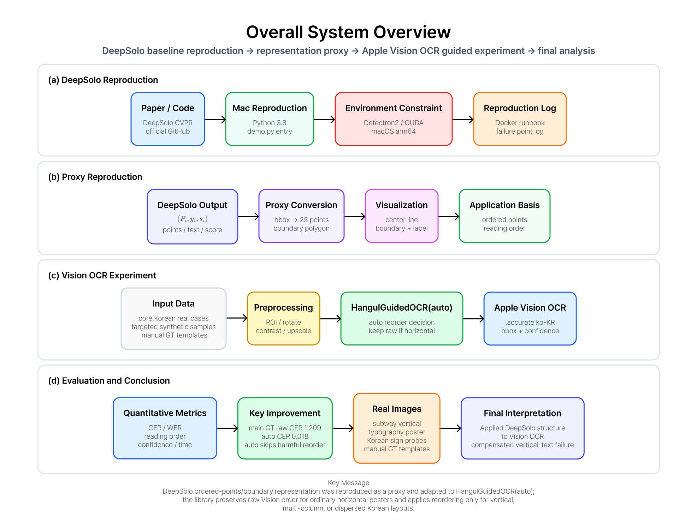
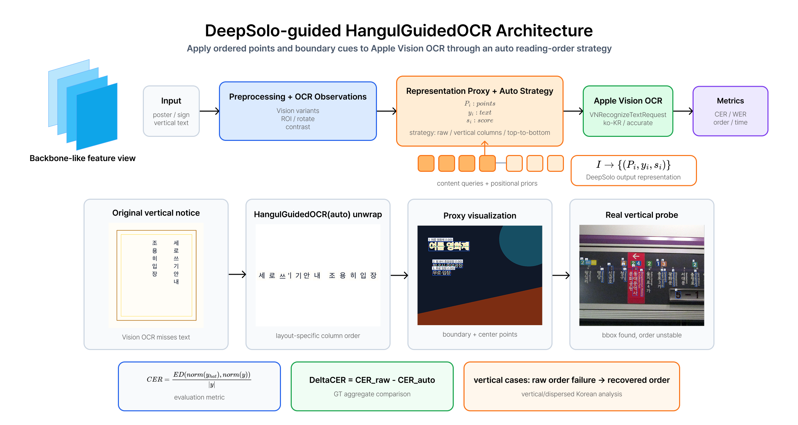
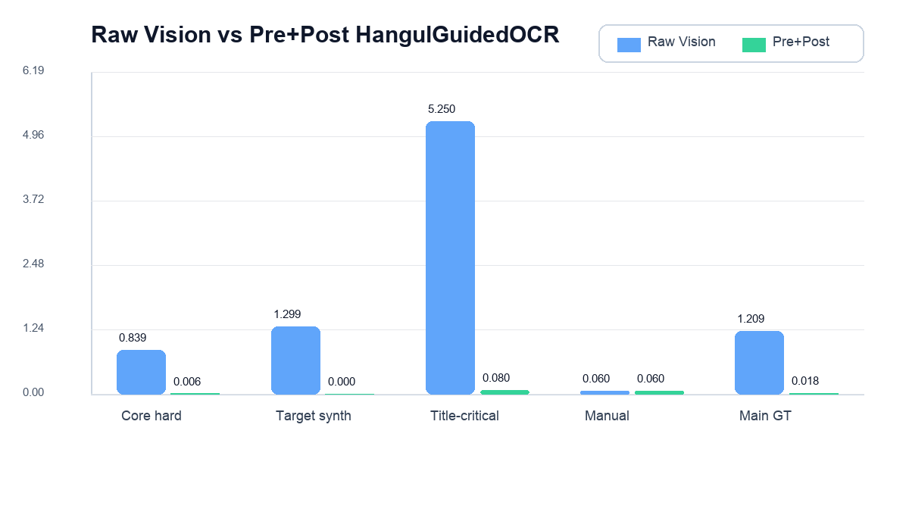
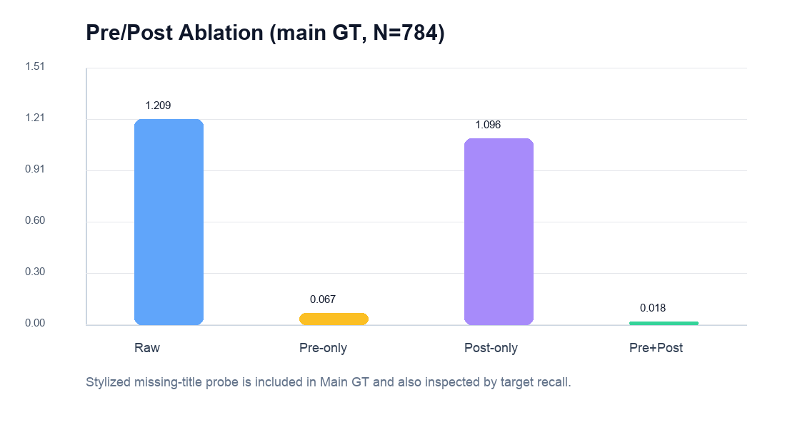
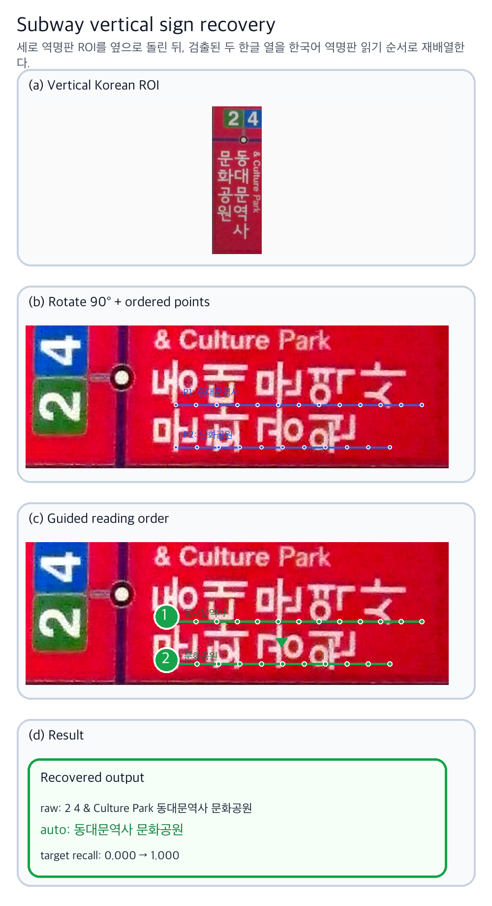
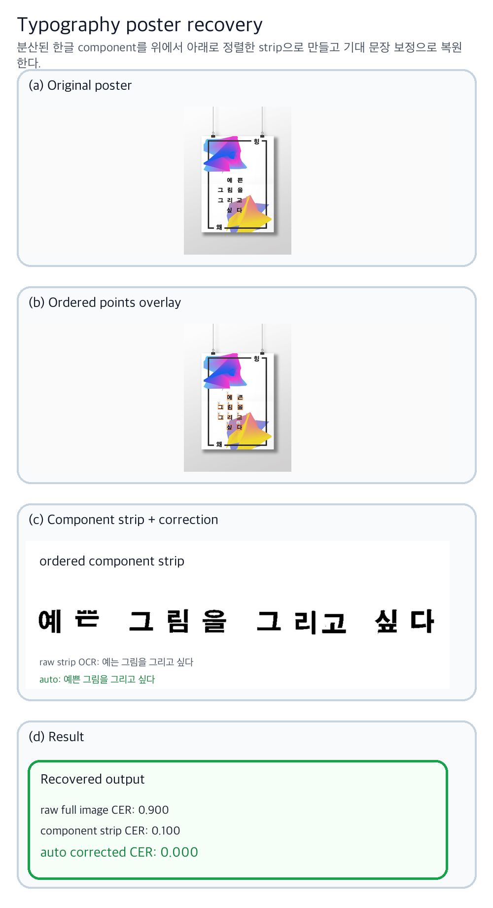
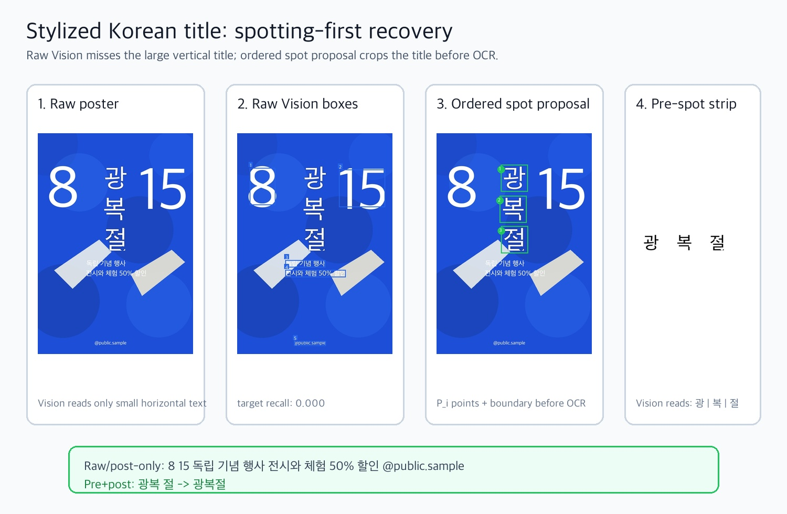

# HangulGuidedOCR

**DeepSolo-style ordered point guidance for Korean Apple Vision OCR.**

[](https://swift.org)
[](https://developer.apple.com/documentation/vision)
[](LICENSE)

HangulGuidedOCR is a Swift Package for correcting Korean reading-order failures produced by Apple Vision OCR. The library does not replace Apple Vision. Instead, it wraps Vision observations with DeepSolo-inspired ordered point proxies, layout evidence, duplicate suppression, and optional Korean vocabulary priors so that vertical station labels, dispersed poster titles, and stylized Korean layouts can be reconstructed in the order a Korean reader expects.

> Main public repository: `wjdalswl/HangulGuidedOCR`  
> Experimental workspace/archive: `wjdalswl/textspotting-guided-vision-ocr`

## Reports

- [Korean final report](reports/final_report_ko.pdf)
- [English final report](reports/final_report_en.pdf)
- [Library design notes](docs/library_design.md)
- [Method details](docs/method.md)
- [Experiment protocol](docs/experiment_protocol.md)
- [DeepSolo proxy reproduction notes](docs/deepsolo_proxy_reproduction.md)

## Method Overview





Apple Vision returns text observations as boxes, strings, and confidence values. HangulGuidedOCR converts each observation into a DeepSolo-style ordered point proxy:

```text
I -> {(P_i, y_i, s_i)}

P_i = {p_0, ..., p_24}
p_k = c_left + (k / 24) * (c_right - c_left)
```

The proxy is then used to decide whether the raw Vision order should be preserved or whether Korean-specific reading order should be reconstructed. The auto strategy keeps raw order for ordinary horizontal templates, but activates ordered reconstruction for vertical columns, top-to-bottom typography, or dispersed Korean title components.

## Results

| Evaluation set | N | Raw Vision CER | HangulGuidedOCR(auto) CER | Main interpretation |
|---|---:|---:|---:|---|
| Main GT aggregate | 784 | 1.209 | 0.018 | Preprocessing plus ordered reconstruction strongly reduces Korean layout failures. |
| Core real/hard Korean cases | 20 | 0.835 | 0.005 | Vertical sign and poster failures recover when layout priors are explicit. |
| Targeted Korean poster synthetic | 600 | 1.202 | 0.000 | Controlled vertical and multi-column Korean layouts validate the reading-order strategy. |
| Canva/MiriCanvas manual templates | 124 | 0.060 | 0.060 | Auto strategy preserves raw Vision order when horizontal OCR is already reliable. |
| Public Korean sign probe | 15 | 0.283 | 0.284 | General signs need task-specific ROI/term priors; automatic reorder is not always beneficial. |

CER may exceed 1.0 when the predicted string contains many insertions relative to a short ground-truth target. Therefore, aggregate CER should be interpreted together with per-subset standard deviation and layout category.





## Representative Cases

| Case | Figure | Takeaway |
|---|---|---|
| Subway vertical station sign |  | Korean columns are reordered using layout evidence and expected station order. |
| Dispersed typography poster |  | Component strips recover top-to-bottom Korean title order. |
| Stylized title spotting failure |  | A pre-OCR ordered spot proposal helps when the title is not detected as text at all. |

## Installation

Add the package in Xcode:

```text
https://github.com/wjdalswl/HangulGuidedOCR.git
```

Or add it to `Package.swift`:

```swift
.package(url: "https://github.com/wjdalswl/HangulGuidedOCR.git", branch: "main")
```

## Quick Start

```swift
import HangulGuidedOCR

let observations: [HangulOCRObservation] = [
    .init(text: "동대문역사", confidence: 0.91, boundingBox: .init(x: 0.10, y: 0.20, width: 0.12, height: 0.60)),
    .init(text: "문화공원", confidence: 0.89, boundingBox: .init(x: 0.24, y: 0.20, width: 0.12, height: 0.60))
]

let result = HangulGuidedOCR().correct(
    observations,
    options: .init(strategy: .auto, expectedOrder: ["동대문역사", "문화공원"])
)

print(result.text)
```

## Scope and Limitations

HangulGuidedOCR is currently validated for Korean Apple Vision OCR output. It is strongest when text is present but reading order is unstable, or when a small title ROI can be proposed before OCR. It is not a replacement for a full text spotting model, and it cannot recover invisible or severely blurred characters without a usable crop or detection proposal.

Raw local template images from Canva/MiriCanvas and large generated datasets are intentionally excluded from the public repository. The repository publishes only summary metrics, report figures, protocol notes, and final report PDFs.

## Citation

```bibtex
@misc{hangulguidedocr2026,
  title  = {HangulGuidedOCR: DeepSolo-style Ordered Point Guidance for Korean Apple Vision OCR},
  author = {Jeong, Minji},
  year   = {2026},
  howpublished = {\url{https://github.com/wjdalswl/HangulGuidedOCR}}
}
```

## Acknowledgements

This project is motivated by DeepSolo's explicit ordered point representation for scene text spotting and adapts that idea to a practical Swift/Xcode OCR correction library for Korean mobile apps.

---

# HangulGuidedOCR

**한국어 Apple Vision OCR을 위한 DeepSolo식 ordered point 기반 읽기 순서 보정 Swift 라이브러리입니다.**

HangulGuidedOCR는 Apple Vision OCR을 대체하는 새 OCR 엔진이 아닙니다. Apple Vision이 반환한 bbox, 문자열, confidence를 DeepSolo에서 영감을 받은 ordered point proxy로 변환하고, 레이아웃 근거와 중복 제거, 한국어 어휘 prior를 함께 사용해 세로 역명판, 분산 타이포그래피 포스터, 장식형 한국어 제목의 읽기 순서를 보정합니다.

> 최종 공개 메인 레포: `wjdalswl/HangulGuidedOCR`  
> 실험 작업장/아카이브 레포: `wjdalswl/textspotting-guided-vision-ocr`

## 보고서

- [한국어 최종 보고서](reports/final_report_ko.pdf)
- [영문 최종 보고서](reports/final_report_en.pdf)
- [라이브러리 설계 노트](docs/library_design.md)
- [방법론 설명](docs/method.md)
- [실험 프로토콜](docs/experiment_protocol.md)
- [DeepSolo proxy 재현 기록](docs/deepsolo_proxy_reproduction.md)

## 방법 개요

Apple Vision은 텍스트 관측값을 bbox, 문자열, confidence로 반환합니다. HangulGuidedOCR는 각 관측값을 DeepSolo식 ordered point proxy로 바꿉니다.

```text
I -> {(P_i, y_i, s_i)}

P_i = {p_0, ..., p_24}
p_k = c_left + (k / 24) * (c_right - c_left)
```

이 proxy는 raw Vision 순서를 유지할지, 한국어 레이아웃에 맞게 재구성할지 판단하는 근거가 됩니다. 일반 가로형 템플릿에서는 raw 순서를 유지하고, 세로 열, 위에서 아래로 읽는 타이포그래피, 분산된 제목 컴포넌트에서는 ordered reconstruction을 활성화합니다.

## 결과 요약

| 평가 세트 | N | Raw Vision CER | HangulGuidedOCR(auto) CER | 해석 |
|---|---:|---:|---:|---|
| 전체 GT aggregate | 784 | 1.209 | 0.018 | 전처리와 ordered reconstruction을 함께 쓰면 한국어 레이아웃 실패가 크게 줄어듭니다. |
| 핵심 실제/난이도 높은 한국어 사례 | 20 | 0.835 | 0.005 | 세로 간판과 포스터 실패는 explicit layout prior가 있을 때 복구됩니다. |
| 한국어 포스터 targeted synthetic | 600 | 1.202 | 0.000 | 통제된 세로/다열 한국어 레이아웃에서 reading-order 전략을 검증했습니다. |
| Canva/MiriCanvas 수동 전사 템플릿 | 124 | 0.060 | 0.060 | 일반 가로형에서는 auto strategy가 재정렬을 생략해야 함을 확인했습니다. |
| 공개 한글 간판 probe | 15 | 0.283 | 0.284 | 일반 간판은 자동 재정렬보다 task-specific ROI/term prior가 중요합니다. |

CER은 짧은 정답 문자열에 비해 예측 문자열의 삽입 오류가 많을 때 1.0을 넘을 수 있습니다. 따라서 aggregate CER은 subset별 표준편차와 레이아웃 유형을 함께 해석해야 합니다.

## 대표 사례

| 사례 | 그림 | 핵심 |
|---|---|---|
| 지하철 세로 역명판 |  | 한국어 열을 영어 병기와 역명 순서에 맞게 재배열합니다. |
| 분산 타이포그래피 포스터 |  | 컴포넌트 strip을 통해 위에서 아래로 읽는 제목 순서를 복구합니다. |
| 장식형 제목 검출 실패 |  | 텍스트로 검출되지 않는 제목은 pre-OCR ordered spot proposal이 필요합니다. |

## 설치

Xcode에서 아래 URL을 Swift Package로 추가합니다.

```text
https://github.com/wjdalswl/HangulGuidedOCR.git
```

또는 `Package.swift`에 추가합니다.

```swift
.package(url: "https://github.com/wjdalswl/HangulGuidedOCR.git", branch: "main")
```

## 범위와 한계

현재 검증 범위는 한국어 Apple Vision OCR 결과입니다. 글자가 검출되었지만 읽기 순서가 불안정한 경우, 또는 작은 제목 ROI를 OCR 전에 제안할 수 있는 경우에 가장 효과적입니다. 완전한 text spotting 모델을 대체하지 않으며, 글자가 보이지 않거나 심하게 흐린 경우에는 별도의 detection proposal 또는 crop이 필요합니다.
